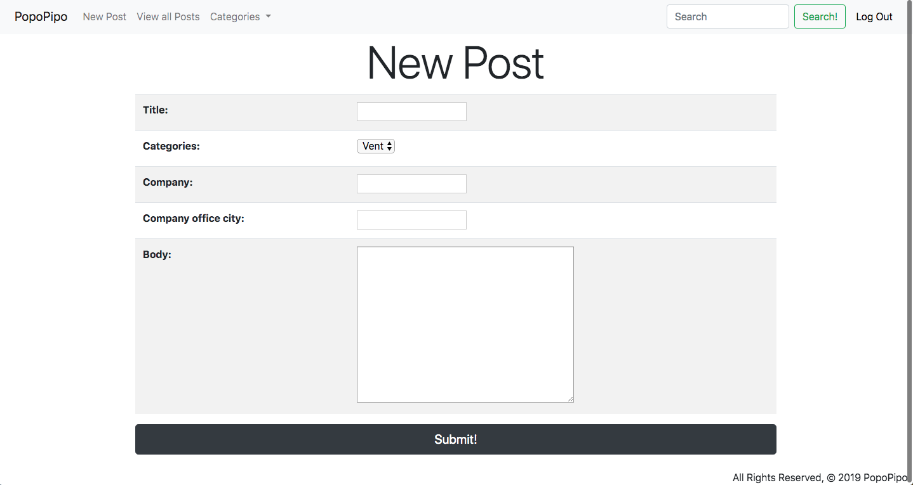

# PopoPipo

## A better way to CONNECT

### Introduction
- The purpose of this web application is to provide an anonymous forum where users can share and discuss topics about their work experience in their company.

### Screenshot

### The Problem
- Workers need a space to:
	- Talk about the pros and cons of working for a company
	- Discuss salaries with no stigma attached
	- Vent unethical workplace behavior without fear of repercussion or retaliation

### Our Solution
- An app that protects the anonyminity of it's users and allows them to post in a safe and civil environment

### Links
- [Trello](https://trello.com/b/ARZrtXpf/popopipo-board)
- [Pitch Deck](https://docs.google.com/presentation/d/1CbD-Lmh8Juw45oZl10vWsDRVLaolzaLF2_E1RR1xqps/edit#slide=id.p)
- [Heroku](https://popopipo.herokuapp.com)

### User Stories
- As a user (AAU), I want to be a NORMAL or ADMIN USER because I want to be able to SignIn & SignOut and have an index list of POSTS
- I want to be able to Create/Read/Update/Delete my POST
- I want to be able to CREATE/READ my COMMENTS in a POST
- I want to only be able to UPDATE/DELETE my own POST and/or COMMENTS
- I want a SEARCH BAR to find a SPECIFIC POST title
- I want to see a VIEW COUNTER for a specific POST based on the numbers of views.
- I want a LIKE feature to LIKE a POST

### ICEBOX features:
- Threaded comments
- Content management and moderation
- Sliding carosel of most active posts
- A responsive 404 page
- Paid features incorporating the Stripe API
- Salary comparison with data visualization 
