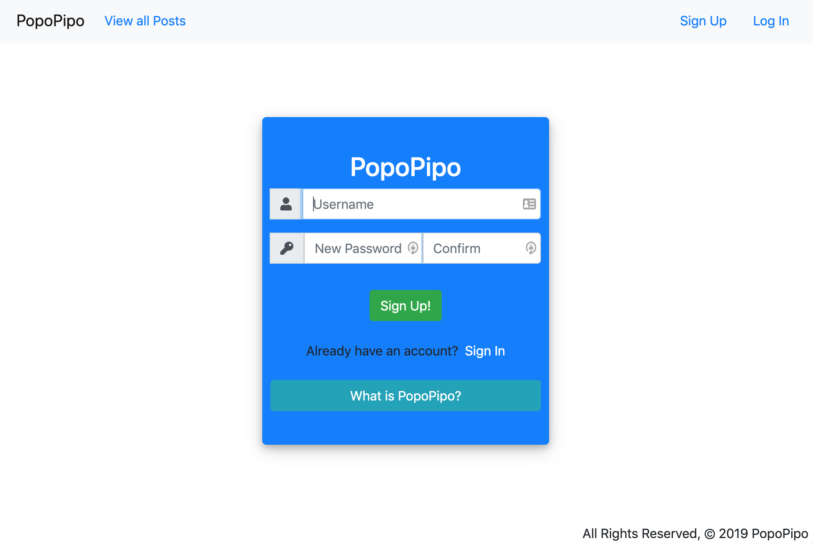

# PopoPipo

## A better way to CONNECT

### Introduction
- The purpose of this web application is to provide an anonymous forum where users can share and discuss topics about their work experience in their company.

### The Problem
- Workers need a space to:
	- Talk about the pros and cons of working for a company
	- Discuss salaries with no stigma attached
	- Vent unethical workplace behavior without fear of repercussion or retaliation

### Screenshot

### Technologies Used
- HTML5
- CSS3
- Bootstrap
- JavaScript
- Python
- Django
- PostgreSQL
- Heroku

### Links
- [Pitch Deck](https://docs.google.com/presentation/d/1CbD-Lmh8Juw45oZl10vWsDRVLaolzaLF2_E1RR1xqps/edit#slide=id.p)
- [Trello](https://trello.com/b/ARZrtXpf/popopipo-board)
- [Heroku](https://popopipo.herokuapp.com)

### Planned Future Enhancements
- Threaded comments
- Sliding carousel of most active posts
- Content management and moderation
- Salary comparison with data visualization 
- A responsive 404 page
- Paid features incorporating the Stripe API